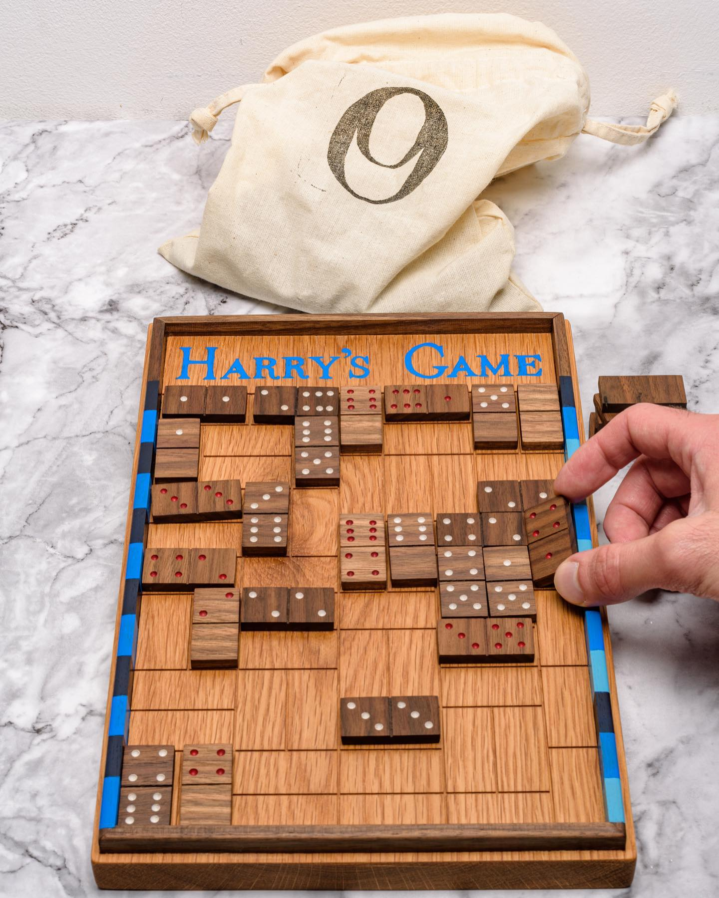

# Harry's Game

What’s in the bag? ——> But of course it’s the game that inspired this whole project. Harry’s Game. Refined and stripped back. Check the etsy shop for further details. Link in bio.

The solid oak play field has grooved lines stating the direction of how dominoes have to be placed. A walnut frame is set into the oak, keeping the dominoes within the play field. Hand painted shades of blue along the frame identifies the player’s colour for their horizontal lanes. Two sets of playing dominoes are made from solid walnut. Each one a real joy to hold in the hand.

Scoring is jotted down on paper. Will be making scoreboards later this month, as an optional accessory.

The rule card has been redesigned, and a separate “menu” card of the end game bonus points has been made. So players can keep an eye out on disrupting opponent lanes or securing their own lanes.

And lastly a couple of cotton bags. One to keep the dominoes in and the other to store the whole game.

#harrysgame #traditionalgames #oakesandoakes #woodengames #vintagegames #oneofakind #hardwood #slowmade #oakboards #tabletopgames #christmaspresents2021 #uniquegifts4all #shoppinguk #madeinbritain #artisanmade #luxuryboardgame #locallymadegoods #dominoes #dominoesgame

## Site

- [local](http://localhost:8000/)
- [Published](https://alexhedley.github.io/harrysgame)

## Run

`py -m http.server`

- [local](http://localhost:8000/)

## License

- [MIT License](LICENSE)
